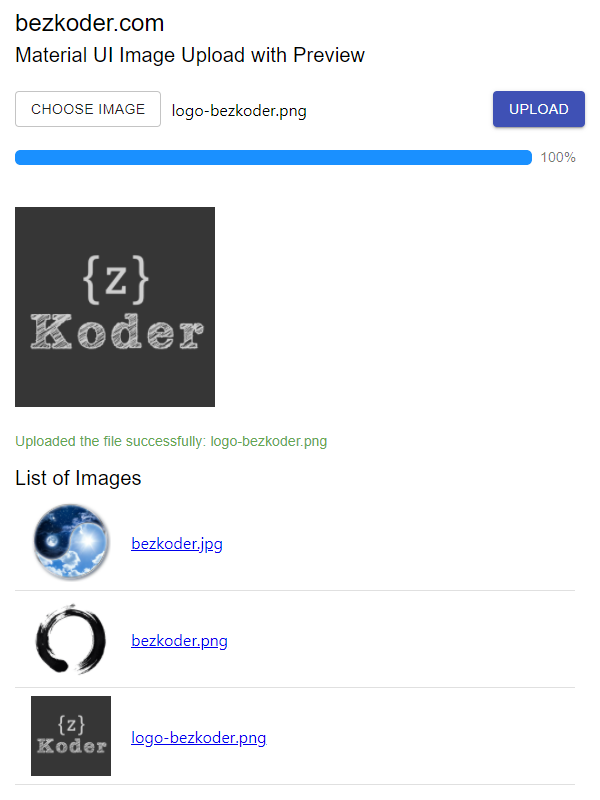

# Material UI Image Upload example with Preview, Axios & Progress Bar
Build Material UI Image Upload example with Preview to Rest API. The React App uses [Axios](https://github.com/axios/axios) and [Multipart](https://www.w3.org/Protocols/rfc1341/7_2_Multipart.html) File for making HTTP requests, Material UI for progress bar and other UI components. You also have a display list of images' information (with download url).

We're gonna create a React Material UI Image upload application in that user can:
- display the preview of image before uploading
- see the upload process (percentage) with progress bar
- view all uploaded images
- link to download the image when clicking on the file name



For instruction, please visit:
> [Material UI Image Upload example with Preview, Axios & Progress Bar](https://bezkoder.com/material-ui-image-upload/)

Rest APIs server for this React Client:
> [Node.js Express File Upload Rest API example](https://bezkoder.com/node-js-express-file-upload/)

> [Spring Boot Multipart File upload example](https://bezkoder.com/spring-boot-file-upload/)

More Practice:
> [React Material UI examples with a CRUD Application](https://bezkoder.com/react-material-ui-examples-crud/)

> [React Pagination with API using Material-UI](https://bezkoder.com/react-pagination-material-ui/)

> [React File Upload with Axios & Boostrap Progress Bar](https://bezkoder.com/react-file-upload-axios/)

> [React (with Hooks) File Upload with Axios & Boostrap Progress Bar](https://bezkoder.com/react-hooks-file-upload/)

> [React JWT Authentication & Authorization example](https://bezkoder.com/react-jwt-auth/)

> [React + Redux: JWT Authentication & Authorization example](https://bezkoder.com/react-redux-jwt-auth/)

## Fullstack CRUD
With Node.js Express:

> [React.js + Node.js Express + MySQL](https://bezkoder.com/react-node-express-mysql/)

> [React.js + Node.js Express + PostgreSQL](https://bezkoder.com/react-node-express-postgresql/)

> [React.js + Node.js Express + MongoDB](https://bezkoder.com/react-node-express-mongodb-mern-stack/)

With Spring Boot:

> [React.js + Spring Boot + MySQL](https://bezkoder.com/react-spring-boot-crud/)

> [React.js + Spring Boot + PostgreSQL](https://bezkoder.com/spring-boot-react-postgresql/)

> [React.js + Spring Boot + MongoDB](https://bezkoder.com/react-spring-boot-mongodb/)

With Django:

> [React.js + Django Rest Framework](https://bezkoder.com/django-react-axios-rest-framework/)

## Serverless
> [React Firebase CRUD App with Realtime Database](https://bezkoder.com/react-firebase-crud/)

> [React Firestore CRUD App example | Firebase Cloud Firestore](https://bezkoder.com/react-firestore-crud/)

This project was bootstrapped with [Create React App](https://github.com/facebook/create-react-app).

### Set port
.env
```
PORT=8081
```

## Project setup

In the project directory, you can run:

```
npm install
# or
yarn install
```

or

### Compiles and hot-reloads for development

```
npm start
# or
yarn start
```

Open [http://localhost:8081](http://localhost:8081) to view it in the browser.

The page will reload if you make edits.
